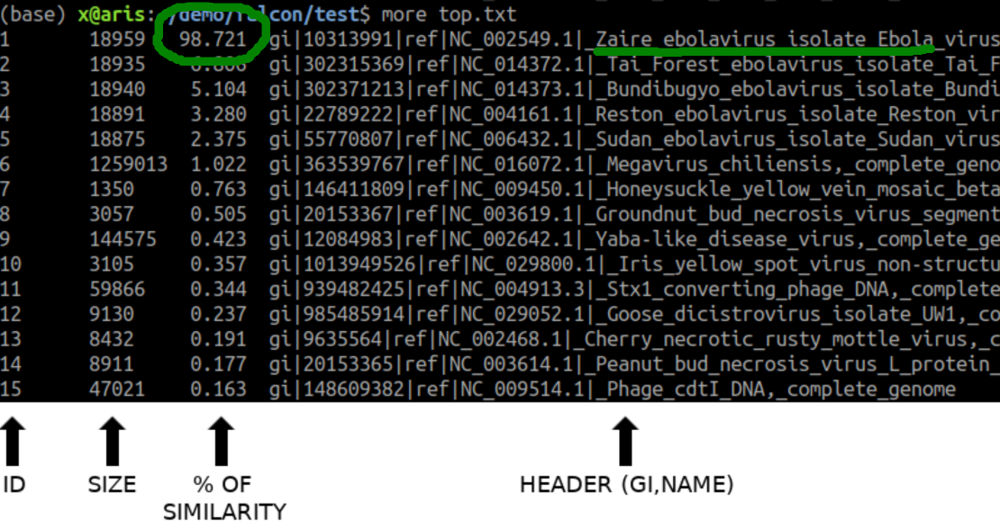

[](LICENSE)

<p align="center"></p>

<p align="justify">
<b>FALCON2 is an ultra-fast method to infer metagenomic composition of sequenced reads</b>. FALCON2 measures <b>similarity between any FASTQ</b> file (or FASTA), independently from the size, <b>against any multi-FASTA database</b>, such as the entire set of complete genomes from the NCBI. FALCON2 supports single reads, paired-end reads, and compositions of both. It has been tested in many platforms, such as Illumina MySeq, HiSeq, Novaseq, IonTorrent.</p>

<p align="justify">
FALCON2 is efficient to detect the presence and authenticate a given species in the FASTQ reads.
The core of the method is based on <b>relative data compression</b>. FALCON2 uses <b>variable multi-threading</b>, without multiplying the memory for each thread, being able to <b>run efficiently in a common laptop</b>.</p>

<p align="justify">
The tool is also able to <b>identify locally where, in each reference sequence, the similarity occurs</b>. FALCON2 provides subcommands to <b>filter the local results (filter)</b>, <b>visualize the results (fvisual)</b>, perform <b>database inter-similarity analysis (inter)</b>, and <b>visualize inter-similarities (ivisual)</b>.
</p>

<br>

[](https://www.youtube.com/watch?v=eLqXE2ghFNk)

<br>

## 1. Installation ##

### 1.1 Manual installation ###

```bash
git clone https://github.com/cobilab/FALCON2.git
cd FALCON2/src/
cmake .
make
cp FALCON2 ../../
cd ../../
```
[Cmake](http://www.cmake.org/) is needed for installation. 

## 2. Demo ##

Search for the top 15 similar viruses in sample reads that we provide in folder test:
```bash
cd test
./FALCON2 meta -v -F -t 15 -l 47 -x top.txt reads.fq.gz VDB.fa.gz
```
It will identify Zaire Ebolavirus in the samples (top.txt) according to the following image

<p align="center"></p>

## 3. Building a reference database ## 

### 3.1 Build the latest NCBI viral database

An example of building a reference database from NCBI:
```bash

```

For building reference databases for multiple domains/kingdoms (bacterial, fungi, protozoa, plant, etc), use:
```bash
https://raw.githubusercontent.com/cobilab/gto/master/scripts/gto_build_dbs.sh
```

### 3.2 Download an existing database ###

<p align="justify">
An already reference viral database is available <a href="http://sweet.ua.pt/pratas/datasets/VDB.fa.gz">here</a>. With this example, you don't need to decompress; use it directly in FALCON2 along with the FASTQ reads.
</p>

## 4. Usage ##

FALCON2 is a unified tool with multiple subcommands:

* <b>FALCON2 meta</b>: metagenomic composition analysis (main FALCON functionality);
* <b>FALCON2 filter</b>: local interactions - localization;
* <b>FALCON2 fvisual</b>: visualization of global and local similarities;
* <b>FALCON2 inter</b>: inter-similarity between database genomes;
* <b>FALCON2 ivisual</b>: visualization of inter-similarities.

### 4.1 Main Menu ###

To see all available commands:
```bash
./FALCON2
```
or
```bash
./FALCON2 -h
```

This will display:
```
COMMANDS
  meta     - Infer metagenomic sample composition
             (Main FALCON functionality)
  filter   - Filter and segment regions identified by FALCON
  fvisual  - Create visualization of filtered regions
  inter    - Evaluate similarity of genomes
  ivisual  - Create heatmap visualization of genome similarities

Use 'FALCON2 <command> -h' for help with a specific command.
```

### 4.2 Metagenomic composition analysis ###

To see the possible options of FALCON2 meta:
```bash
./FALCON2 meta -h
```

This will print the following options:
```
Non-mandatory arguments:

  -h, --help                   show this help message
  -F, --force                  overwrite output files
  -V, --version                display version and exit
  -v, --verbose                verbose mode (more information)
  -Z, --local                  database local similarity
  -s, --show                   show compression levels

  -l, --level <level>          compression level [1;47]
  -p, --sample <rate>          subsampling (default: 1)
  -t, --top <num>              top of similarity (default: 20)
  -n, --nThreads <num>         number of threads (default: 2)

  -x, --output <file>          similarity top filename
  -y, --profile <file>         profile filename (-Z must be on)

  -S, --save-model             save models after learning
  -L, --load-model             load models previously saved model
  -M, --model-file <file>      model filename
  -I, --model-info             model info

  -T, --train-model            train model only (no inference)
                               (Attention!) Is expected to only receive
                               the first file group (FASTQ)

Mandatory arguments:

  [FILE1]:[FILE2]:...  metagenomic filename (FASTQ),
                       Use ":" for splitting files.

  [FILE1]:[FILE2]:...  database filename (Multi-FASTA).
                       Use ":" for splitting files.


MAGNET integration:

  -mg, --magnet                enable MAGNET filtering

  Mandatory arguments:

  -mf, --magnet-filter <file>  FASTA reference for filtering

  Non-mandatory arguments:

  -mv, --magnet-verbose        verbose mode (more information)
  -mt <val>                    similarity threshold [0.0;1.0] (default: 0.9)
  -ml <val>                    sensitivity level [1;44] (default: 36)
  -mi, --magnet-invert         invert filter
  -mp <val>                    portion of acceptance (default: 1)
```

**Example usage:**
```bash
./FALCON2 meta -v -F -l 47 -Z -y profile.com reads1.fq:reads2.fq VDB.fa
```

### 4.3 Local detection ###

For local interactions detection and visualization, FALCON2 provides the <b>filter</b> and <b>fvisual</b> subcommands.

#### 4.3.1 Filtering ####

To see the possible options of FALCON2 filter:
```bash
./FALCON2 filter -h
```

This will print the following options:
```
Non-mandatory arguments:

  -h                     give this help
  -F                     force mode (overwrites top file)
  -V                     display version number
  -v                     verbose mode (more information)

  -s  <size>             filter window size
  -w  <type>             filter window type
  -x  <sampling>         filter window sampling
  -sl <lower>            similarity lower bound
  -su <upper>            similarity upper bound
  -dl <lower>            size lower bound
  -du <upper>            size upper bound
  -t  <threshold>        threshold [0;2.0]

  -o  <FILE>             output segmented filename

Mandatory arguments:

  [FILE]                 profile filename (from FALCON2 meta).
```

**Example usage:**
```bash
./FALCON2 filter -v -F -t 0.5 -o positions.pos profile.com
```

#### 4.3.2 Visualization ####

To see the possible options of FALCON2 fvisual:
```bash
./FALCON2 fvisual -h
```

This will print the following options:
```
Non-mandatory arguments:

  -h                  give this help
  -F                  force mode (overwrites top file)
  -V                  display version number
  -v                  verbose mode (more information)

  -w  <width>         square width (for each value)
  -s  <ispace>        square inter-space (between each value)
  -i  <indexs>        color index start
  -r  <indexr>        color index rotations
  -u  <hue>           color hue
  -sl <lower>         similarity lower bound
  -su <upper>         similarity upper bound
  -dl <lower>         size lower bound
  -du <upper>         size upper bound
  -g  <color>         color gamma
  -e  <size>          enlarge painted regions

  -bg                 show only the best of group
  -ss                 do NOT show global scale
  -sn                 do NOT show names

  -o <FILE>           output image (SVG) filename

Mandatory arguments:

  [FILE]              segmented filename (from FALCON2 filter).
```

**Example usage:**
```bash
./FALCON2 fvisual -v -F -o map.svg positions.pos
```

### 4.4 Database inter-similarity ###

#### 4.4.1 Mapping inter-similarity ####

To see the possible options of FALCON2 inter:
```bash
./FALCON2 inter -h
```

This will print the following options:
```
Non-mandatory arguments:

  -h                   give this help
  -V                   display version number
  -v                   verbose mode (more information)
  -s                   show compression levels
  -l <level>           compression level [1;30]
  -n <nThreads>        number of threads
  -x <FILE>            similarity matrix filename
  -o <FILE>            labels filename

Mandatory arguments:

  [FILE]:[FILE]:[...]  input files (last arguments).
                       Use ":" for file splitting.
```

**Example usage:**
```bash
./FALCON2 inter -v file1.fa:file2.fa:file3.fa
```

#### 4.4.2 Inter-similarity visualization ####

To see the possible options of FALCON2 ivisual:
```bash
./FALCON2 ivisual -h
```

This will print the following options:
```
Non-mandatory arguments:

  -h             give this help
  -V             display version number
  -v             verbose mode (more information)
  -w             square width (for each value)
  -a             square inter-space (between each value)
  -s             index color start
  -r             index color rotations
  -u             color hue
  -g             color gamma
  -l <FILE>      labels filename
  -x <FILE>      heatmap filename

Mandatory arguments:

  [FILE]         input matrix file (from FALCON2 inter).
```

**Example usage:**
```bash
./FALCON2 ivisual -F -l labels.txt -o heatmap.svg matrix.txt
```

## 5. Common use ##

Create the following bash script:

```bash
#!/bin/bash
./FALCON2 meta -v -n 4 -t 200 -F -Z -l 47 -y complexity.com $1 $2
./FALCON2 filter -v -F -t 0.5 -o positions.pos complexity.com
./FALCON2 fvisual -v -F -o draw.svg positions.pos
```

Name it FALCON2-meta.sh and give run access:
```bash
chmod +x FALCON2-meta.sh
```

Then, run FALCON2:
```bash
./FALCON2-meta.sh reads1.fastq:reads2.fastq VDB.fa
```

reads1.fastq, reads2.fastq, and VDB.fa are only examples.

## 6. New Features in FALCON2 ##

### 6.1 Model Management ###

FALCON2 introduces the ability to save and load trained models for faster subsequent analyses:

```bash
# Train and save a model
./FALCON2 meta -v -l 47 -S -M mymodel.bin -T reads.fq

# Load a previously trained model
./FALCON2 meta -v -l 47 -L -M mymodel.bin reads.fq VDB.fa
```

Options:
- `-S, --save-model`: Save models after learning
- `-L, --load-model`: Load previously saved model
- `-M, --model-file <file>`: Specify model filename
- `-I, --model-info`: Display model information
- `-T, --train-model`: Train model only (no inference)

### 6.2 MAGNET Integration ###

FALCON2 now integrates MAGNET filtering for enhanced read processing:

```bash
./FALCON2 meta -v -l 47 -mg -mf reference.fa -mt 0.9 -ml 36 reads.fq VDB.fa
```

Options:
- `-mg, --magnet`: Enable MAGNET filtering
- `-mf, --magnet-filter <file>`: FASTA reference for filtering (mandatory with `-mg`)
- `-mv, --magnet-verbose`: Verbose mode for MAGNET
- `-mt <val>`: Similarity threshold [0.0;1.0] (default: 0.9)
- `-ml <val>`: Sensitivity level [1;44] (default: 36)
- `-mi, --magnet-invert`: Invert filter
- `-mp <val>`: Portion of acceptance (default: 1)

## 7. Issues ##

For any issue let us know at [issues link](https://github.com/cobilab/FALCON2/issues).

## 8. License ##

GPL v3.

For more information see LICENSE file or visit
<pre>http://www.gnu.org/licenses/gpl-3.0.html</pre>

---

**Copyright (C) 2014-2025, IEETA, University of Aveiro.**
