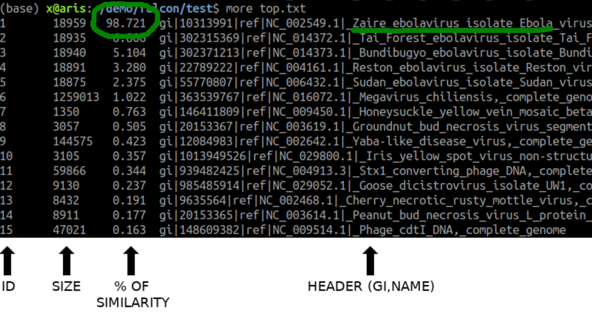

<!-- README.md -->

<div align="center">

<!-- Badges -->
  
  
  
  
  <br><br>

</div>

<p align="center">
  
</p>

<p align="center">
  <b>🦅 Fast compression-based metagenomic classification<br/>of ancient and modern sequencing reads</b>
</p>

---

## ✨ What is FALCON2?

<p align="justify">
<b>FALCON2 is a fast alignment-free framework for inferring metagenomic composition from sequencing reads.</b>
It measures the <b>similarity between FASTQ or FASTA samples</b> and <b>large multi-FASTA reference databases</b>, ranging from curated collections to comprehensive repositories such as complete NCBI genome sets. FALCON2 supports single-end reads, paired-end reads, mixed datasets, and can also be applied to <b>long-read sequencing data</b>, making it a flexible solution across diverse sequencing technologies and experimental designs.
</p>

<p align="justify">
FALCON2 is based on <b>relative data compression</b>, providing a robust compression-based and alignment-free strategy for metagenomic screening, species detection, and sequence authentication. The method has been tested in <b>ancient metagenomics</b>, where it achieved <b>state-of-the-art results</b>, specifically in the analysis of ancient viral content. Its implementation uses <b>shared-memory multithreading</b>, avoiding memory replication across threads and enabling efficient execution even on standard laptop hardware.
</p>

<p align="justify">
Beyond global similarity ranking, FALCON2 can also <b>identify where similarity occurs locally within each reference sequence</b>. To support downstream analysis, the toolkit provides dedicated subcommands to <b>filter local matches (<code>filter</code>)</b>, <b>visualize similarity profiles (<code>fvisual</code>)</b>, compute <b>inter-similarity across reference databases (<code>inter</code>)</b>, and <b>visualize inter-genome similarity maps (<code>ivisual</code>)</b>. Although originally developed for metagenomic screening, FALCON2 is <b>generalizable</b> and can be used in a broad range of comparative sequence analysis settings.
</p>

### ✅ Highlights

- ⚡ **High speed** — shared-memory multithreading in C; runs on standard laptop hardware
- 🧬 **Alignment-free** — robust compression-based similarity without sequence alignment
- 🏺 **Ancient DNA optimized** — state-of-the-art results for ancient viral metagenomics
- 🗺️ **Local similarity** — identifies where similarity occurs within each reference sequence
- 💾 **Model management** — save and reload trained models for faster re-analysis

---

## 🧭 Contents

- [⚙️ Installation](#️-installation)
- [🚀 Quickstart demo](#-quickstart-demo)
- [🗄️ Building a reference database](#️-building-a-reference-database)
- [🧰 Commands](#-commands)
- [🧾 Help and parameters](#-help-and-parameters)
- [📚 Detailed CLI reference](#-detailed-cli-reference)
- [🔁 Common pipeline](#-common-pipeline)
- [🆕 New features](#-new-features)
- [📝 Citation](#-citation)
- [🐛 Issues](#-issues)
- [📜 License](#-license)

---

 

## ⚙️ Installation

<!--[](https://www.youtube.com/watch?v=eLqXE2ghFNk)-->


### 🟩 Option A - Conda (recommended)

Install Miniconda, then:

```bash
conda install -y -c bioconda falcon2
```

### 🏗️ Option B - Build from source (CMake)

Requirements: `cmake`, `git`, and a C compiler toolchain.

```bash
git clone https://github.com/cobilab/FALCON2.git
cd FALCON2/src/
cmake .
make
cp FALCON2 ../
cd ../
```

---

## 🚀 Quickstart demo

Search for the top 15 similar viruses in sample reads that we provide in folder test:
```bash
cp FALCON2 test/
cd test
./FALCON2 meta -v -F -t 15 -l 47 -x top.txt reads.fq.gz VDB.fa.gz
```
This will identify **Zaire Ebolavirus** in the sample (`top.txt`):

<p align="center"></p>

---

## 🗄️ Building a reference database

### Build the latest NCBI viral database

An example of building a reference database from NCBI:
```bash
# Download reference genomes from NCBI (append <organism> as an argument; defaults to "viruses" if none is provided)
https://raw.githubusercontent.com/cobilab/FALCON2/main/utils/download_references_ncbi.sh

# Use process_gz_files.sh for compressed files (It will concatenate all .gz files)
https://raw.githubusercontent.com/cobilab/FALCON2/main/utils/process_gz_files.sh

# Alternative: Manual concatenation from decompressed files
cat /path/to/reference_fastas/*.fna > input-sequences.fna
```

For building reference databases for multiple domains/kingdoms (bacterial, fungi, protozoa, plant, etc), use:
```bash
https://raw.githubusercontent.com/cobilab/gto/master/scripts/gto_build_dbs.sh
```

### Download an existing database

A pre-built viral reference database is available <a href="http://sweet.ua.pt/pratas/datasets/VDB.fa.gz">here</a>:

```bash
wget http://sweet.ua.pt/pratas/datasets/VDB.fa.gz
```

> No decompression needed — use `VDB.fa.gz` directly with FALCON2.

---

## 🧰 Commands

FALCON2 is a unified tool with multiple subcommands:

| Subcommand | Description                                                  |
|---|--------------------------------------------------------------|
| 🧬 `meta` | Metagenomic composition analysis (main FALCON functionality) |
| ✂️ `filter` | Local interactions - localization                            |
| 🎨 `fvisual` | Visualization of global and local similarities               |
| 🔗 `inter` | Inter-similarity between database genomes                    |
| 🗺️ `ivisual` | Visualization of inter-similarities.                         |


---

## 🧾 Help and parameters

Top-level help:
```bash
./FALCON2
# or
./FALCON2 -h
```

Per-subcommand help:

```bash
./FALCON2 meta -h
./FALCON2 filter -h
./FALCON2 fvisual -h
./FALCON2 inter -h
./FALCON2 ivisual -h
```

---

## 📚 Detailed CLI reference


<details>
<summary><b>🧬 FALCON2 meta — Metagenomic composition analysis</b></summary>

```text
NAME
      FALCON2 meta

DESCRIPTION
      Infer metagenomic sample composition from sequencing reads
      against a multi-FASTA reference database.

PARAMETERS

  Non-mandatory arguments:

  -h, --help                   show this help message
  -F, --force                  overwrite output files
  -V, --version                display version and exit
  -v, --verbose                verbose mode (more information)
  -Z, --local                  compute database local similarity
  -s, --show                   show compression levels

  -l, --level <level>          compression level [1;47]
  -p, --sample <rate>          subsampling rate (default: 1)
  -t, --top <num>              number of top results (default: 20)
  -n, --nThreads <num>         number of threads (default: 2)

  -x, --output <file>          similarity top output filename
  -y, --profile <file>         profile filename (requires -Z)

  -S, --save-model             save models after learning
  -L, --load-model             load a previously saved model
  -M, --model-file <file>      model filename
  -I, --model-info             display model information
  -T, --train-model            train model only (no inference)
                               (expects only the FASTQ file group)

  Mandatory arguments:

  [FILE1]:[FILE2]:...          metagenomic reads (FASTQ)
                               use ":" to split across files

  [FILE1]:[FILE2]:...          reference database (multi-FASTA)
                               use ":" to split across files

  MAGNET integration:

  -mg, --magnet                enable MAGNET filtering
  -mf, --magnet-filter <file>  FASTA reference for filtering (mandatory with -mg)
  -mv, --magnet-verbose        verbose mode for MAGNET
  -mt <val>                    similarity threshold [0.0;1.0] (default: 0.9)
  -ml <val>                    sensitivity level [1;44] (default: 36)
  -mi, --magnet-invert         invert filter
  -mp <val>                    portion of acceptance (default: 1)

SYNOPSIS
      FALCON2 meta [OPTIONS] [FASTQ] [DATABASE]

EXAMPLE
      ./FALCON2 meta -v -F -l 47 -Z -y profile.com reads1.fq:reads2.fq VDB.fa
```

</details>

<details>
<summary><b>✂️ FALCON2 filter — Local similarity filtering</b></summary>

```text
NAME
      FALCON2 filter

DESCRIPTION
      Filter and segment regions identified by FALCON2 meta
      from a local similarity profile.

PARAMETERS

  Non-mandatory arguments:

  -h                     show this help
  -F                     force mode (overwrites output file)
  -V                     display version number
  -v                     verbose mode (more information)

  -s  <size>             filter window size
  -w  <type>             filter window type
  -x  <sampling>         filter window sampling
  -sl <lower>            similarity lower bound
  -su <upper>            similarity upper bound
  -dl <lower>            size lower bound
  -du <upper>            size upper bound
  -t  <threshold>        threshold [0;2.0]

  -o  <FILE>             output segmented filename

  Mandatory arguments:

  [FILE]                 profile filename (from FALCON2 meta)

SYNOPSIS
      FALCON2 filter [OPTIONS] [PROFILE]

EXAMPLE
      ./FALCON2 filter -v -F -t 0.5 -o positions.pos profile.com
```

</details>

<details>
<summary><b>🎨 FALCON2 fvisual — Local similarity visualization</b></summary>

```text
NAME
      FALCON2 fvisual

DESCRIPTION
      Generate an SVG visualization of filtered local similarity regions.

PARAMETERS

  Non-mandatory arguments:

  -h                  show this help
  -F                  force mode (overwrites output file)
  -V                  display version number
  -v                  verbose mode (more information)

  -w  <width>         square width (for each value)
  -s  <ispace>        square inter-space (between each value)
  -i  <indexs>        color index start
  -r  <indexr>        color index rotations
  -u  <hue>           color hue
  -sl <lower>         similarity lower bound
  -su <upper>         similarity upper bound
  -dl <lower>         size lower bound
  -du <upper>         size upper bound
  -g  <color>         color gamma
  -e  <size>          enlarge painted regions

  -bg                 show only the best of group
  -ss                 do NOT show global scale
  -sn                 do NOT show names

  -o <FILE>           output image filename (SVG)

  Mandatory arguments:

  [FILE]              segmented filename (from FALCON2 filter)

SYNOPSIS
      FALCON2 fvisual [OPTIONS] [SEGMENTED_FILE]

EXAMPLE
      ./FALCON2 fvisual -v -F -o map.svg positions.pos
```

</details>

<details>
<summary><b>🔗 FALCON2 inter — Database inter-similarity</b></summary>

```text
NAME
      FALCON2 inter

DESCRIPTION
      Evaluate pairwise similarity across genomes in a reference database.

PARAMETERS

  Non-mandatory arguments:

  -h                   show this help
  -V                   display version number
  -v                   verbose mode (more information)
  -s                   show compression levels
  -l <level>           compression level [1;30]
  -n <nThreads>        number of threads
  -x <FILE>            similarity matrix output filename
  -o <FILE>            labels output filename

  Mandatory arguments:

  [FILE]:[FILE]:[...]  input FASTA files (last arguments)
                       use ":" for file splitting

SYNOPSIS
      FALCON2 inter [OPTIONS] [FILE]:[FILE]:...

EXAMPLE
      ./FALCON2 inter -v -x matrix.txt -o labels.txt file1.fa:file2.fa:file3.fa
```

</details>

<details>
<summary><b>🗺️ FALCON2 ivisual — Inter-similarity heatmap</b></summary>

```text
NAME
      FALCON2 ivisual

DESCRIPTION
      Generate an SVG heatmap visualization of inter-genome similarities.

PARAMETERS

  Non-mandatory arguments:

  -h             show this help
  -V             display version number
  -v             verbose mode (more information)
  -w             square width (for each value)
  -a             square inter-space (between each value)
  -s             color index start
  -r             color index rotations
  -u             color hue
  -g             color gamma
  -l <FILE>      labels filename
  -x <FILE>      heatmap output filename

  Mandatory arguments:

  [FILE]         input matrix file (from FALCON2 inter)

SYNOPSIS
      FALCON2 ivisual [OPTIONS] [MATRIX_FILE]

EXAMPLE
      ./FALCON2 ivisual -v -F -l labels.txt -x heatmap.svg matrix.txt
```

</details>

---

## 🔁 Common pipeline

Save the following as `FALCON2-meta.sh` and run it for a complete meta → filter → visualize workflow:

```bash
#!/bin/bash
./FALCON2 meta    -v -n 4 -t 200 -F -Z -l 47 -y complexity.com $1 $2
./FALCON2 filter  -v -F -t 0.5 -o positions.pos complexity.com
./FALCON2 fvisual -v -F -o draw.svg positions.pos
```

```bash
chmod +x FALCON2-meta.sh
./FALCON2-meta.sh reads1.fastq:reads2.fastq VDB.fa
```

---

## 🆕 New features

### 💾 Model management

Save and reload trained models for faster re-analysis:

```bash
# Train and save a model
./FALCON2 meta -v -l 47 -S -M mymodel.fcm -T reads.fq

# Load and reuse a previously trained model
./FALCON2 meta -v -l 47 -L -M mymodel.fcm reads.fq VDB.fa
```

| Flag | Description |
|---|---|
| `-S, --save-model` | Save models after learning |
| `-L, --load-model` | Load a previously saved model |
| `-M, --model-file <file>` | Specify model filename |
| `-I, --model-info` | Display model information |
| `-T, --train-model` | Train model only (no inference) |

### 🔗 MAGNET integration

Filter reads with MAGNET before classification:

```bash
./FALCON2 meta -v -l 47 -mg -mf reference.fa -mt 0.9 -ml 36 reads.fq VDB.fa
```

| Flag | Description |
|---|---|
| `-mg, --magnet` | Enable MAGNET filtering |
| `-mf, --magnet-filter <file>` | FASTA reference for filtering (mandatory with `-mg`) |
| `-mv, --magnet-verbose` | Verbose mode for MAGNET |
| `-mt <val>` | Similarity threshold [0.0;1.0] (default: 0.9) |
| `-ml <val>` | Sensitivity level [1;44] (default: 36) |
| `-mi, --magnet-invert` | Invert filter |
| `-mp <val>` | Portion of acceptance (default: 1) |

---

## 📝 Citation

If you use FALCON2 in your research, please cite:

* L. L. Marques, A. J. Pinho, D. Pratas. **FALCON2: compression-based metagenomic classification of ancient viruses.** *Bioinformatics*, 2026. [https://doi.org/10.1093/bioinformatics/btag155](https://doi.org/10.1093/bioinformatics/btag155)

---

## 🐛 Issues

Please report bugs and feature requests via GitHub Issues:  
[https://github.com/cobilab/FALCON2/issues](https://github.com/cobilab/FALCON2/issues)

---

## 📜 License

This project is licensed under **GPL v3**. See [`LICENSE`](LICENSE).
GNU GPL v3: [http://www.gnu.org/licenses/gpl-3.0.html](http://www.gnu.org/licenses/gpl-3.0.html)
